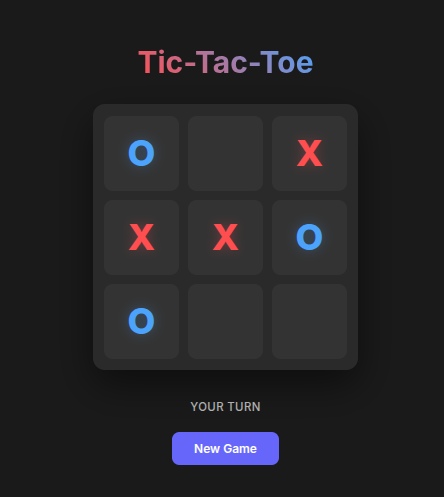

# Крестики-нолики (Tic-Tac-Toe)

[](https://www.java.com/)
[](https://spring.io/projects/spring-boot)
[](https://react.dev/)
[](https://www.typescriptlang.org/)
[](https://vitejs.dev/)
[](https://www.docker.com/)

## Описание

Полнофункциональное веб-приложение классической игры "Крестики-нолики" с современной многоуровневой архитектурой. Проект демонстрирует лучшие практики разработки с использованием Spring Boot для backend и React для frontend.

<p align="center">
  
</p>

## Особенности

- ✅ **Backend на Spring Boot 3.2.2** - REST API с полной документацией OpenAPI/Swagger
- ✅ **Frontend на React 19.2.0** - современный реактивный пользовательский интерфейс
- ✅ **TypeScript 5.9.3** - строгая типизация для надежного кода
- ✅ **Docker Compose** - простое одноэтапное развертывание
- ✅ **Слоистая архитектура** - разделение на слои (Web, Domain, Datasource)
- ✅ **Dependency Injection** - управление зависимостями через Spring DI
- ✅ **API документация** - интерактивная Swagger UI

## Структура проекта

```text
Tic-Tac-Toe/
├── backend/                    # Spring Boot приложение
│   ├── src/main/java/org/example/
│   │   ├── Main.java          # Точка входа приложения
│   │   ├── web/               # REST контроллеры
│   │   ├── domain/            # Бизнес-логика
│   │   ├── datasource/        # Работа с данными
│   │   └── di/                # Конфигурация DI
│   ├── build.gradle.kts       # Gradle конфигурация
│   └── Dockerfile             # Docker образ для backend
│
├── frontend/                   # React приложение
│   ├── src/
│   │   ├── App.tsx           # Главный компонент
│   │   ├── hooks/            # Custom React hooks
│   │   ├── interfaces/       # TypeScript интерфейсы
│   │   └── main.tsx          # Точка входа
│   ├── package.json          # Зависимости npm
│   ├── vite.config.ts        # Vite конфигурация
│   └── Dockerfile            # Docker образ для frontend
│
└── docker-compose.yml        # Оркестрация контейнеров
```

## Предварительные требования

### Для локальной разработки

- **Java 18+** ([установка](https://www.oracle.com/java/technologies/downloads/))
- **Node.js 20+** и npm ([установка](https://nodejs.org/))
- **Gradle** (встроен через Gradle Wrapper)

### Для развертывания с Docker

- **Docker** 29.2.1+
- **Docker Compose** 1.29.2+

## 🚀 Как пользоваться приложением

После запуска контейнеров или локальных серверов, проект доступен по следующим адресам:

### 🖥 Пользовательский интерфейс (Frontend)

Основная игровая панель, где происходит вся магия игры.

- **URL:** [http://localhost:3000](http://localhost:3000) (Docker Compose)
- **URL:** [http://localhost:5173](http://localhost:5173) (локальная разработка)

### ⚙️ Инструменты разработчика (Backend)

Backend работает в режиме **Headless API** — корневой путь не предназначен для прямого открытия. Используйте следующие ресурсы:

| Ресурс | Ссылка | Описание |
| --- | --- | --- |
| **Swagger UI** | [🔗 Открыть документацию](http://localhost:8080/swagger-ui.html) | Интерактивная документация API. |
| **OpenAPI (JSON)** | [📄 Спецификация](http://localhost:8080/v3/api-docs) | JSON-спецификация для генерации клиентов или импорта в Postman. |

### 📡 Примеры взаимодействия с API

```bash
# Создать новую игру (POST /game?size=3)
curl -s -X POST "http://localhost:8080/game?size=3" \
           -H "Content-Type: application/json"

# Сделать ход (POST /game/{id}) — в теле передаётся объект `GameSessionDTO`
# Пример корректного JSON (числовая карта: 0=empty, 1=X, 2=O):
curl -X POST "http://localhost:8080/game/828bf6bb-2725-493c-b052-6ce0d5faaa7b" \
     -H "Content-Type: application/json" \
     -d '{
          "id": "828bf6bb-2725-493c-b052-6ce0d5faaa7b",
          "gameMap": {
               "map": [
                    [2, 2, 1],
                    [1, 1, 2],
                    [2, 1, 1]
               ],
               "size": 3
          },
          "status": "PLAYING"
     }'

# Примечание: контроллер берёт `id` из пути и перезаписывает идентификатор из тела,
# поэтому передавать `id` в теле не обязательно — важно корректное содержимое `gameMap` и `status`.

```

## 🔧 Установка и запуск

### Вариант 1 — развертывание с Docker Compose (рекомендуется)

- **Клонируйте репозиторий**

```bash
git clone <repository-url>
cd Tic-Tac-Toe
```

- **Запустите приложение**

```bash
docker-compose up -d
```

- **Откройте приложение**

- Frontend: [http://localhost:3000](http://localhost:3000)
- Backend API: [http://localhost:8080](http://localhost:8080)
- API документация: [http://localhost:8080/swagger-ui.html](http://localhost:8080/swagger-ui.html)

- **Остановка приложения**

```bash
docker-compose down
```

### Вариант 2 — локальная разработка

#### Backend (Spring Boot)

- **Перейдите в директорию backend**

```bash
cd backend
```

- **Создайте jar файл**

```bash
./gradlew build
```

- **Запустите приложение**

```bash
./gradlew bootRun
```

Backend будет доступен по [http://localhost:8080](http://localhost:8080)

#### Frontend (React)

- **Перейдите в директорию frontend**

```bash
cd frontend
```

- **Установите зависимости**

```bash
npm install
```

- **Запустите dev сервер**

```bash
npm run dev
```

Frontend доступен по [http://localhost:5173](http://localhost:5173) (dev сервер Vite)

## Доступные команды

### Backend (Gradle)

| Команда | Описание |
| --- | --- |
| `./gradlew build` | Сборка проекта |
| `./gradlew bootRun` | Запуск приложения |
| `./gradlew test` | Запуск тестов |
| `./gradlew clean` | Очистка артефактов сборки |

### Frontend (npm)

| Команда | Описание |
| --- | --- |
| `npm run dev` | Разработка с горячей перезагрузкой |
| `npm run build` | Production сборка |
| `npm run lint` | Проверка кода с ESLint |
| `npm run format` | Форматирование кода Prettier |
| `npm run preview` | Просмотр production сборки |

## API документация

### О Backend

Backend приложения — это **Headless REST API**, разработанный на Spring Boot 3. Он обеспечивает полный функционал игровой логики через HTTP endpoints.

### Доступные ресурсы

После запуска backend, полная документация API доступна в Swagger UI:

- **Swagger UI:** [http://localhost:8080/swagger-ui.html](http://localhost:8080/swagger-ui.html)
- **OpenAPI JSON:** [http://localhost:8080/v3/api-docs](http://localhost:8080/v3/api-docs)

Вы можете тестировать все API endpoints прямо из Swagger интерфейса!

## Архитектура

### Backend архитектура (слои)

```text
┌─────────────────────────────────────────┐
│       Web Layer (Controller)            │
│     Обработка HTTP запросов             │
└──────────────┬──────────────────────────┘
               │
┌──────────────▼──────────────────────────┐
│      Domain Layer (Service)             │
│     Бизнес-логика приложения            │
└──────────────┬──────────────────────────┘
               │
┌──────────────▼──────────────────────────┐
│    Datasource Layer (Repository)        │
│   Работа с хранилищем данных            │
└─────────────────────────────────────────┘
```

### Компоненты

- **Web Layer**: REST контроллеры, DTO модели, мапперы
- **Domain Layer**: Бизнес-логика, entity модели, интерфейсы репозитория
- **Datasource Layer**: Реализация репозитория, работа с памятью
- **DI Configuration**: Spring конфигурация бинов

### Frontend архитектура

- **React Components**: Функциональные компоненты с hooks
- **Custom Hooks**: Переиспользуемая логика (useGame)
- **TypeScript Interfaces**: Строгая типизация
- **Vite**: Быстрая разработка и оптимизированная сборка

## Зависимости

### Backend

- **Java 18**
- **Spring Boot 3.2.2**
- **SpringDoc OpenAPI 2.3.0**

### Frontend

- **React 19.2.0**
- **TypeScript 5.9.3**
- **Vite 7.2.4**
- **ESLint** - Проверка кода
- **Prettier** - Форматирование кода
