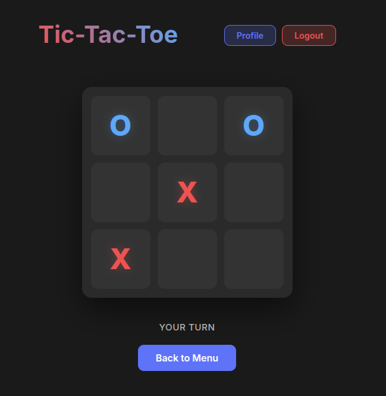
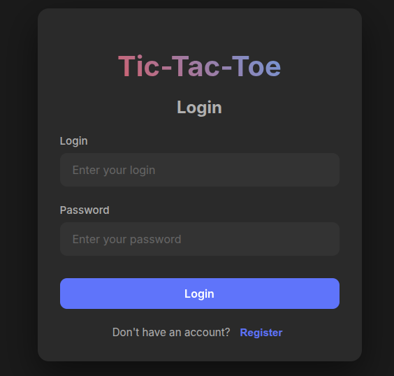
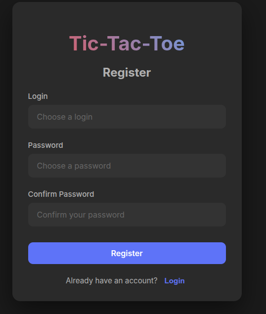
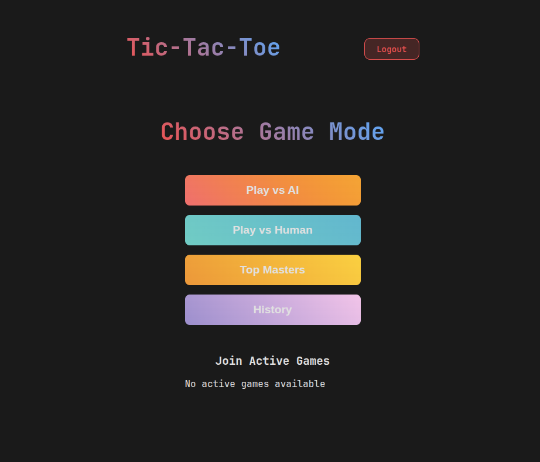

# Крестики-нолики (Tic-Tac-Toe)

[](https://www.java.com/)
[](https://spring.io/projects/spring-boot)
[](https://react.dev/)
[](https://www.typescriptlang.org/)
[](https://vitejs.dev/)
[](https://www.docker.com/)
[](https://www.postgresql.org/)

## Описание

Полнофункциональное веб-приложение классической игры "Крестики-нолики" с системой авторизации, профилем пользователя и современной многоуровневой архитектурой. Проект демонстрирует лучшие практики разработки с использованием Spring Boot для backend и React для frontend.

<p align="center">
  
</p>

## Особенности

- ✅ **Spring Boot 3.3.4 Backend** — REST API с полной документацией OpenAPI/Swagger
- ✅ **React 19.2.0 Frontend** — современный реактивный пользовательский интерфейс
- ✅ **TypeScript 5.9.3** — строгая типизация для надежного кода
- ✅ **PostgreSQL 15** — надёжное хранение данных игр и пользователей
- ✅ **Spring Security** — базовая аутентификация и регистрация
- ✅ **Docker Compose** — простое одноэтапное развертывание (3 контейнера: DB, Backend, Frontend)
- ✅ **Слоистая архитектура** — разделение на слои (Web, Domain, Datasource)
- ✅ **Dependency Injection** — управление зависимостями через Spring DI
- ✅ **API документация** — интерактивная Swagger UI

## Скриншоты

### Форма входа

<p align="center">
  
</p>

### Форма регистрации

<p align="center">
  
</p>

### Меню выбора режима игры

<p align="center">
  
</p>

## Структура проекта

```text
Tic-Tac-Toe/
├── backend/                    # Spring Boot приложение
│   ├── src/main/java/org/example/
│   │   ├── Main.java          # Точка входа приложения
│   │   ├── web/               # REST контроллеры (Auth, Game)
│   │   ├── domain/            # Бизнес-логика (Auth, Game, User)
│   │   ├── datasource/        # Работа с данными (JPA, PostgreSQL)
│   │   └── di/                # Конфигурация DI и Security
│   ├── build.gradle.kts       # Gradle конфигурация
│   └── Dockerfile             # Docker образ для backend
│
├── frontend/                   # React приложение
│   ├── src/
│   │   ├── App.tsx           # Главный компонент
│   │   ├── components/       # UI компоненты (Login, Register, Game, Profile)
│   │   ├── contexts/         # React Context (AuthContext)
│   │   ├── hooks/            # Custom React hooks (useGame)
│   │   └── interfaces/       # TypeScript интерфейсы
│   ├── package.json          # Зависимости npm
│   ├── vite.config.ts        # Vite конфигурация
│   └── Dockerfile            # Docker образ для frontend
│
└── docker-compose.yml        # Оркестрация контейнеров (DB + Backend + Frontend)
```

## Предварительные требования

### Для локальной разработки

- **Java 18+** ([установка](https://www.oracle.com/java/technologies/downloads/))
- **Node.js 20+** и npm ([установка](https://nodejs.org/))
- **PostgreSQL 15+** (или используйте Docker Compose)
- **Gradle** (встроен через Gradle Wrapper)

### Для развертывания с Docker

- **Docker** 20.10+
- **Docker Compose** 2.0+

## 🚀 Как пользоваться приложением

После запуска контейнеров или локальных серверов, проект доступен по следующим адресам:

### 🖥 Пользовательский интерфейс (Frontend)

Основная игровая панель, где происходит вся магия игры.

- **URL:** [http://localhost:3001](http://localhost:3001) (Docker Compose)
- **URL:** [http://localhost:5173](http://localhost:5173) (локальная разработка)

### ⚙️ Инструменты разработчика (Backend)

Backend работает в режиме **Headless API** — корневой путь не предназначен для прямого открытия. Используйте следующие ресурсы:

| Ресурс | Ссылка | Описание |
| --- | --- | --- |
| **Swagger UI** | [🔗 Открыть документацию](http://localhost:8081/swagger-ui.html) | Интерактивная документация API. |
| **OpenAPI (JSON)** | [📄 Спецификация](http://localhost:8081/v3/api-docs) | JSON-спецификация для генерации клиентов или импорта в Postman. |

### 📡 Примеры взаимодействия с API

```bash
# Регистрация нового пользователя
curl -X POST "http://localhost:8081/auth/signup" \
     -H "Content-Type: application/json" \
     -d '{"username": "player1", "password": "secret123"}'

# Авторизация
curl -X POST "http://localhost:8081/auth/login" \
     -H "Content-Type: application/json" \
     -d '{"username": "player1", "password": "secret123"}'

# Создать новую игру (POST /game?size=3)
curl -s -X POST "http://localhost:8081/game?size=3" \
     -u "$TICTACTOE_USER:$TICTACTOE_PASS"

# Получить статус игры
curl "http://localhost:8081/game/{id}" \
     -u "$TICTACTOE_USER:$TICTACTOE_PASS"
```

## 🔧 Установка и запуск

### Вариант 1 — развертывание с Docker Compose (рекомендуется)

- **Клонируйте репозиторий**

```bash
git clone <repository-url>
cd Tic-Tac-Toe
```

- **Создайте файл .env** (если отсутствует)

```env
DB_NAME=game_sessions_storage
DB_USER=postgres
DB_PASSWORD=postgres
DB_INTERNAL_PORT=5432
DB_EXTERNAL_PORT=5433
BACKEND_INTERNAL_PORT=8080
BACKEND_EXTERNAL_PORT=8081
FRONTEND_EXTERNAL_PORT=3001
```

- **Запустите приложение**

```bash
docker compose up --build -d
```

- **Откройте приложение**

- Frontend: [http://localhost:3001](http://localhost:3001)
- Backend API: [http://localhost:8081](http://localhost:8081)
- API документация: [http://localhost:8081/swagger-ui.html](http://localhost:8081/swagger-ui.html)

- **Остановка приложения**

```bash
docker compose down
```

### Вариант 2 — локальная разработка

#### PostgreSQL

```bash
docker run -d --name postgres-db \
  -e POSTGRES_DB=game_sessions_storage \
  -e POSTGRES_USER=postgres \
  -e POSTGRES_PASSWORD=postgres \
  -p 5433:5432 \
  postgres:15-alpine
```

#### Backend (Spring Boot)

- **Перейдите в директорию backend**

```bash
cd backend
```

- **Установите переменные окружения**

```bash
export SPRING_DATASOURCE_URL=jdbc:postgresql://localhost:5433/game_sessions_storage
export SPRING_DATASOURCE_USERNAME=postgres
export SPRING_DATASOURCE_PASSWORD=postgres
```

- **Создайте jar файл**

```bash
./gradlew build
```

- **Запустите приложение**

```bash
./gradlew bootRun
```

Backend будет доступен по [http://localhost:8081](http://localhost:8081)

#### Frontend (React)

- **Перейдите в директорию frontend**

```bash
cd frontend
```

- **Установите зависимости**

```bash
npm install
```

- **Запустите dev сервер**

```bash
npm run dev
```

Frontend доступен по [http://localhost:5173](http://localhost:5173) (dev сервер Vite)

## Доступные команды

### Backend (Gradle)

| Команда | Описание |
| --- | --- |
| `./gradlew build` | Сборка проекта |
| `./gradlew bootRun` | Запуск приложения |
| `./gradlew test` | Запуск тестов |
| `./gradlew clean` | Очистка артефактов сборки |

### Frontend (npm)

| Команда | Описание |
| --- | --- |
| `npm run dev` | Разработка с горячей перезагрузкой |
| `npm run build` | Production сборка |
| `npm run lint` | Проверка кода с ESLint |
| `npm run format` | Форматирование кода Prettier |
| `npm run preview` | Просмотр production сборки |

## API документация

### О Backend

Backend приложения — это **Headless REST API**, разработанный на Spring Boot 3. Он обеспечивает полный функционал игровой логики и авторизации через HTTP endpoints.

### Основные endpoints

| Метод | Endpoint | Описание |
| --- | --- | --- |
| `POST` | `/auth/signup` | Регистрация нового пользователя |
| `POST` | `/auth/login` | Авторизация (возвращает cookie сессии) |
| `GET` | `/user/profile` | Профиль текущего пользователя |
| `POST` | `/game?size=3` | Создать новую игру |
| `POST` | `/game/{id}` | Сделать ход |
| `GET` | `/game/{id}` | Получить статус игры |
| `GET` | `/game` | Список всех игр пользователя |

### Доступные ресурсы

После запуска backend, полная документация API доступна в Swagger UI:

- **Swagger UI:** [http://localhost:8081/swagger-ui.html](http://localhost:8081/swagger-ui.html)
- **OpenAPI JSON:** [http://localhost:8081/v3/api-docs](http://localhost:8081/v3/api-docs)

Вы можете тестировать все API endpoints прямо из Swagger интерфейса!

## Архитектура

### Backend архитектура (слои)

```text
┌─────────────────────────────────────────┐
│       Web Layer (Controller)            │
│     Обработка HTTP запросов             │
│     AuthController, GameController      │
└──────────────┬──────────────────────────┘
               │
┌──────────────▼──────────────────────────┐
│      Domain Layer (Service)             │
│     Бизнес-логика приложения            │
│     AuthService, GameService, UserService
└──────────────┬──────────────────────────┘
               │
┌──────────────▼──────────────────────────┐
│    Datasource Layer (Repository)        │
│   Работа с PostgreSQL (JPA/Hibernate)   │
└─────────────────────────────────────────┘
```

### Компоненты

- **Web Layer**: REST контроллеры, DTO модели, мапперы, фильтры авторизации
- **Domain Layer**: Бизнес-логика, entity модели, интерфейсы репозитория, сервисы
- **Datasource Layer**: JPA репозитории, мапперы сущностей, PostgreSQL
- **DI Configuration**: Spring конфигурация бинов, Security конфигурация

### Frontend архитектура

- **React Components**: Функциональные компоненты (LoginForm, RegisterForm, GameModeSelection, UserProfile)
- **Context API**: AuthContext для управления состоянием авторизации
- **Custom Hooks**: Переиспользуемая логика (useGame)
- **TypeScript Interfaces**: Строгая типизация
- **Vite**: Быстрая разработка и оптимизированная сборка

## Зависимости

### Backend

- **Java 18**
- **Spring Boot 3.3.4**
- **SpringDoc OpenAPI 2.6.0**
- **Spring Security** — авторизация и базовая аутентификация
- **Spring Data JPA** — работа с БД
- **PostgreSQL** — основная база данных
- **H2** — база данных для тестов

### Frontend

- **React 19.2.0**
- **TypeScript 5.9.3**
- **Vite 7.2.4**
- **ESLint** — Проверка кода
- **Prettier** — Форматирование кода
